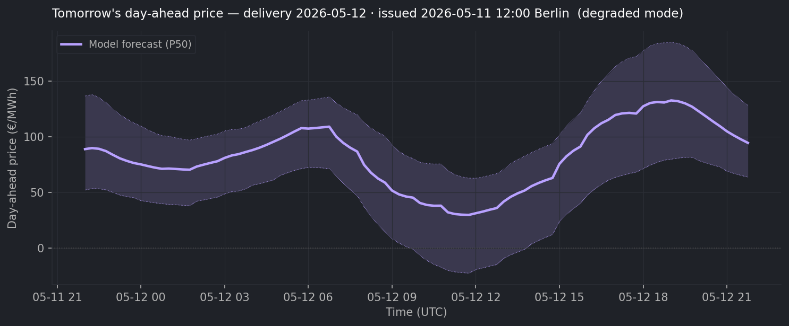
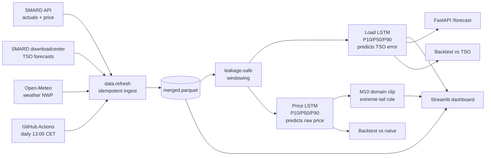

# German Day-Ahead Forecasting — Load and Price

[](https://github.com/connectashish028/german-load-forecast/actions/workflows/daily_refresh.yml)

> Two LSTMs trained on public German grid data. The **load model** beats the TSO's published forecast by **20 %** across a 14-month holdout. The **price model** captures **95 % of perfect-foresight battery P&L** (+€57 k uplift over a 61-day holdout vs a naive trader).

### → Live demo: **[german-load-forecast-v1.streamlit.app](https://german-load-forecast-v1.streamlit.app/)**

Switch between LOAD and PRICE views. Pick tomorrow or any past delivery day; see model forecast, realised values, TSO baseline (load) or naive yesterday baseline (price), per-day error, hour-of-day breakdown, and battery-dispatch P&L panel.


**Tomorrow's forecasts** — re-rendered every day from the live models:




## Why this project

Every European grid operator publishes a forecast of how much electricity the country will use the next day. In Germany this lives on the public [SMARD](https://www.smard.de/) portal as `fc_cons__grid_load`, and it's the **operational baseline** every utility, energy trader, and balancing-responsible party plans against. **Beating that real, public, operational forecast is the load model's job.**

The **day-ahead spot price** clears in the EPEX auction at 12:00 Berlin time; this is the signal that maps to € on a battery operator's, balancing-responsible party's, or intraday trader's P&L. **The price model's job is to predict that clearing price four hours before the gate closes**, accurately enough to dispatch a battery against it and capture as much of the theoretical-max arbitrage P&L as possible.

Most ML portfolio projects compare to a naive baseline and stop there. Beating real, public, *operational* numbers — and being able to point to live values — is a qualitatively different signal.

### Where the improvement comes from

#### Load model

Five LSTM variants, each adding one feature group on top of the previous, all scored on the same 70-day test set:

| Variant | Improvement vs TSO | Δ vs previous |
|---|---|---|
| Calendar only (hour / day-of-week / holiday) | +4.7 % | — |
| + Recent load history | +9.7 % | +5.0 pp |
| **+ Recent forecast error** (`actual − TSO`) | **+23.7 %** | **+13.9 pp** ⭐ |
| + TSO forecast as a decoder feature | +22.9 % | −0.8 pp |
| + Weather (4 NWP variables) | +24.2 % | +1.4 pp |

The single biggest lever is **showing the model the operator's recent errors**. On its own that one feature delivers more than half the project's total improvement. Adding the operator's forecast a second time as a decoder feature is roughly neutral — a deliberate negative result, since the model is already trained to predict the operator's *error*, the forecast itself doesn't carry extra signal.

#### Price model

Four iterations, each tackling a specific failure mode:

| Version | Change | Result on the 61-day Mar–Apr 2026 holdout |
|---|---|---|
| v1 | Encoder = price + load + actual VRE; decoder = TSO load + weather | +18 % MAE vs naive, but **−65 % spread MAE** — median collapse |
| v2 | + `fc_gen__pv+wind` (TSO day-ahead VRE forecast) | +34 % MAE vs naive, spread gap closed to −23 % |
| v3 | + 30 % feature-dropout on `fc_gen` for graceful degradation | Full mode unchanged; degraded mode still beats naive by 19 % — model runs all day, not just after 12:30 |
| **v4** | + Engineered `vre_to_load_ratio` / `vre_percentile`; 3× weight on holidays + Sundays; 0.5× weight on 2022–2023 | **+36 % MAE vs naive on average, +60 % on the worst 10 % of days** |
| v4 + clip | Domain-rule shift on holiday × top-1 % VRE days, calibrated on 2024–2025 (the M10 patch) | May 1, 2026 (−500 €/MWh): MAE 81.8 → 72.8 |

**The headline trading metric: dispatch a 10 MW / 20 MWh battery against the v4 P50 forecast on each delivery day. The model captures 95.0 % of perfect-foresight P&L vs the naive baseline's 81.3 %** — a +€57 k uplift over the 61-day holdout, ~€1.7 M/year on a 100 MWh fleet.

A surprise finding: P50-only dispatch out-performs P10-charge / P90-discharge dispatch by ~2 pp. **Battery dispatch is a ranking problem, not a calibration problem** — what matters is which slots are cheapest, not the absolute spread.

## Architecture



Every prediction respects an **issue-time cutoff of 12:00 Berlin time on the day before delivery** — the EPEX day-ahead market gate. A "corrupt-future" test scrambles every post-cutoff value in the source data and asserts the resulting features are byte-for-byte identical, so leakage isn't a thing we hope for, it's tested.

A **GitHub Action** runs the refresh + smoke-check + tomorrow-PNG renders every day at 13:00 CET. The deployed Streamlit dashboard auto-redeploys on every commit, so the live forecasts are always current with no human intervention.

## Approach

- **Residual learning for load.** Predicts the *operator's error* — `actual − TSO_forecast` — and adds the correction. The operator already nails calendar + climatology; the model only learns the systematic remainder.
- **Raw target for price.** No published baseline exists for day-ahead price, so the model targets the raw clearing price; naive yesterday-same-quarter-hour is the comparison.
- **Seq2seq LSTM.** 64-unit encoder reads 7 days of history; hands state to a 64-unit decoder generating 96 quarter-hour predictions. Three quantile heads (P10/P50/P90), pinball loss, ~36 k parameters per model. Both train in under 5 minutes on CPU.
- **Graceful degradation when features publish late.** SMARD's day-ahead VRE forecast occasionally publishes after the EPEX gate. The price model is trained with 30 % feature-dropout on it so it falls back to weather + load + calendar; the dashboard surfaces a `DEGRADED MODE` badge in that state.
- **Domain rule for the negative-price tail.** Pinball-loss P50 structurally can't reach −500 €/MWh on rare regime days. A small post-processing shift, calibrated empirically on out-of-holdout data, applies on holiday × top-1 %-VRE days.
- **Self-refreshing data layer.** SMARD and Open-Meteo expose authentication-free APIs. One CLI command rebuilds the parquet; a GitHub Action does it nightly at 13:00 CET, smoke-checks both models, and commits both PNGs back.
- **Leakage tested.** A "corrupt-future" test scrambles every post-issue value and asserts the feature arrays are byte-identical.

## Repo layout

```
src/loadforecast/
  data/      # multi-source ingestion (SMARD API, SMARD downloadcenter, Open-Meteo)
  features/  # leakage-safe feature builders (calendar, lags, availability)
  models/    # Keras models (load + price), windowing, predict wrappers, extreme-tail clip
  backtest/  # rolling-origin evaluator + TSO + SARIMAX baselines
  serve/     # FastAPI inference service (load model)
dashboards/  # Streamlit dashboard with LOAD / PRICE views
tests/       # pytest — leakage tests, baseline harness, API smoke
notebooks/   # data audit + modelling/explanation notebooks
scripts/     # training, refresh, render-PNG, smoke-check, P&L simulation
model_checkpoints/
  lstm_quantile_v1/    # load model
  price_quantile_v4/   # price model + extreme_clip.json
backtest_results/      # holdout CSVs + battery-dispatch P&L
```

## Quickstart

```bash
conda create -n loadforecast python=3.11 -y
conda activate loadforecast
pip install uv && uv pip install -e ".[dev]"

# 1. Verify install
pytest -q

# 2. Refresh the parquet from public APIs (~5 min)
python -m loadforecast.data.refresh --rebuild --start 2022-01-01

# 3. Train the load model (~3 min)
python scripts/train_lstm_quantile.py

# 4. Train the price model + calibrate the M10 clip (~5 min)
python scripts/train_lstm_price_quantile.py
python scripts/calibrate_extreme_clip.py

# 5. Backtests + battery P&L
python -m loadforecast.backtest --predictor lstm_weather \
    --start 2025-01-01 --end 2026-04-30 --step-days 7 \
    --out backtest_results/lstm_weather_step7.csv
python scripts/backtest_price_quantile.py
python scripts/run_battery_pnl.py

# 6. Dashboard
streamlit run dashboards/app.py

# 7. Or hit the load-model inference service
uvicorn loadforecast.serve.api:app
# then POST to localhost:8000/forecast {"delivery_date": "2026-05-08"}
```

## Data sources

| Source | What | Auth |
|---|---|---|
| [SMARD](https://www.smard.de/) **API** (Bundesnetzagentur) | Total grid load, residual load, day-ahead clearing price, actual generation by source | none |
| **SMARD downloadcenter** (JSON) | TSO day-ahead load forecast, TSO day-ahead PV+wind forecast | none |
| [Open-Meteo](https://open-meteo.com/) | NWP (temperature, solar radiation, wind speed at 100 m, cloud cover; population-weighted across 6 German load centres) | none |

All data is licensed CC-BY 4.0.

## What's next

This project is feature-complete. The daily GitHub Action keeps the parquet, both tomorrow PNGs, and the deployed dashboard current; ongoing work is maintenance (data-source resilience, dependency upgrades) rather than new features.

## License

MIT. Data: CC-BY 4.0 (SMARD / Bundesnetzagentur, ENTSO-E).
