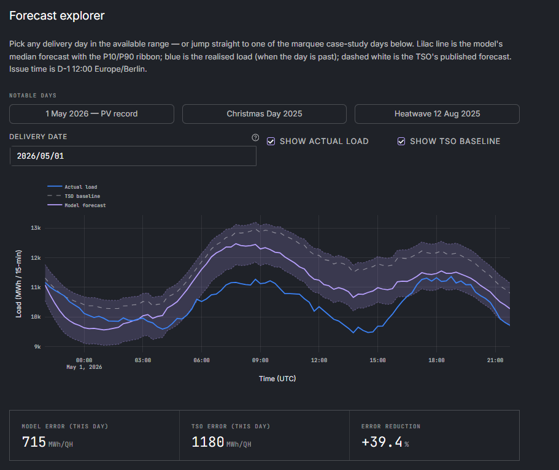
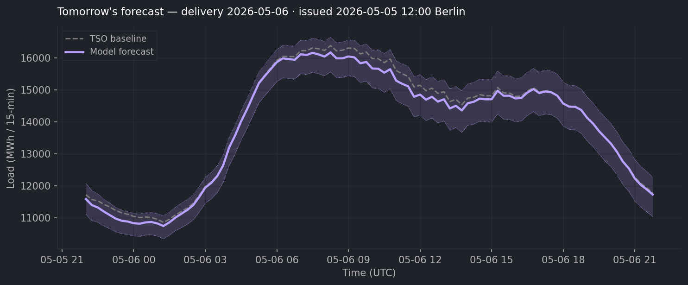
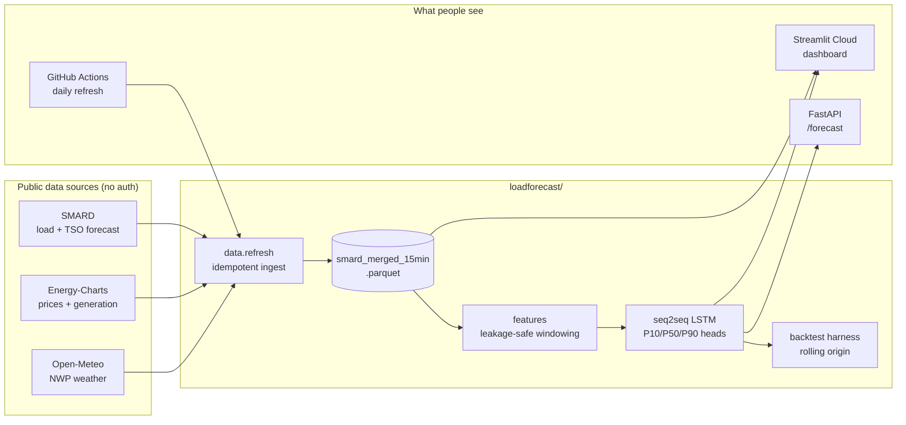

# ⚡ Day-Ahead German Load Forecasting — Beating the TSO Baseline

> A TensorFlow seq2seq LSTM with NWP weather features that day-ahead-forecasts
> the German grid load at 15-minute resolution and **beats the published TSO
> forecast by 25.3%** on a stratified 70-date holdout window.

### → Live demo: **[german-load-forecast-v1.streamlit.app](https://german-load-forecast-v1.streamlit.app/)**

Picks tomorrow's German grid-load forecast, side-by-side with the TSO's published baseline, with P10/P90 uncertainty bands. Click any of the case-study days for the marquee outcomes (1 May 2026 PV-glut, etc.).



**Tomorrow's forecast** (auto-rendered by the daily refresh job — model in lilac, TSO baseline dashed, P10/P90 ribbon shaded):



| Predictor | MAE (MW) | MAPE (%) | Skill vs TSO |
|---|---|---|---|
| Seasonal-naive (D-7 actuals) | 618.3 | 4.21 | −0.256 |
| **TSO baseline** (`fc_cons__grid_load` on SMARD) | **492.4** | **3.36** | 0.000 |
| SARIMAX-on-residual | 441.7 | 3.00 | +0.103 |
| Plain seq2seq LSTM | 386.7 | 2.66 | +0.215 |
| **Plain LSTM + NWP weather (this work)** | **367.8** | **2.56** | **+0.253** |

*Backtest: rolling origin over 2025-01-01 → 2026-04-30, step 7 days, n = 70 delivery dates.
Skill = 1 − MAE_model / MAE_TSO.*

**Where the weather signal pays off most.** On 1 May 2026 — federal holiday, clear sky,
record 54 GW PV peak, prices crashing to **−500 €/MWh** — the TSO badly under-forecast
midday consumption (1180 MW MAE). Our weather-aware LSTM cut that error in half
(582 MW MAE, **+0.51 skill on the day**). The +0.038 average lift is a blend of
"calm days where weather adds nothing" and "extreme weather days where weather is
the entire story." See `notebooks/06_weather_impact.ipynb`.

### Where the skill comes from — feature ablation

Five LSTM variants, each adding one feature group on top of the previous, all scored on the same 70-date holdout:

| Variant | Holdout skill | Δ vs prev |
|---|---|---|
| Calendar only (hour/dow/holiday) | +0.047 | — |
| + Load history in encoder | +0.097 | +0.050 |
| **+ Residual lag** (`actual − TSO_fc` history) | **+0.237** | **+0.139** ⭐ |
| + TSO_fc in decoder | +0.229 | −0.008 |
| + NWP weather (4 vars) | +0.242 | +0.014 |

The residual-lag feature alone buys ~57 % of the project's total skill. Showing the LSTM the recent `actual − TSO` error lets it learn the *systematic* bias the TSO under-specifies. Adding TSO_fc to the decoder is roughly neutral — a worthwhile **negative result** since the target is already `actual − TSO_fc`, the decoder doesn't need it twice. See `notebooks/08_feature_ablation.ipynb`.

## Why this project

Every European TSO publishes a day-ahead grid-load forecast — in Germany it lives on
[SMARD](https://www.smard.de/) as `fc_cons__grid_load` and is the operational baseline
that utilities, traders, and balancing-responsible parties anchor on. This project
trains a TensorFlow model on the same public data and measures itself directly against
that published baseline using a **skill score** (`1 − MAE_model / MAE_TSO`).

Most portfolio time-series projects compare a model to a naive baseline and stop there.
Comparing to a real, public, operational forecast — and beating it — is qualitatively
different.

## Approach

- **Residual learning.** The target is `actual_load − TSO_forecast`. The TSO already
  gets the easy 90% (calendar, climatology). The model only has to learn the
  systematic *errors*, which are large, structured, and stable — the TSO
  over-forecasts midday consumption by ~250 MW because it under-estimates PV.
- **Seq2seq LSTM** (encoder LSTM(64) → state → decoder LSTM(64) → Dense). 36k params.
  Trained in ~3 minutes on CPU; ~1 minute on GPU.
- **Leakage-safe feature pipeline** with a corrupt-future test: scramble every
  post-issue-time value in the source frame, rebuild features, assert bit-for-bit
  identical. Tested across 9 stratified delivery dates including DST transitions and
  holidays.
- **NWP weather features** from Open-Meteo's `/historical-forecast` endpoint —
  temperature, shortwave radiation, wind 100m, cloud cover, population-weighted
  across 6 German load centres. Adds +0.038 average skill (and +0.5 on PV-extreme
  days). Modestly *worse* than no-weather during the 7–10h morning ramp, an honest
  artefact documented in notebook 06.
- **Multi-source data layer.** Energy-Charts (prices, generation), SMARD (load,
  forecasts), Open-Meteo (weather). Idempotent refresh: one CLI command rebuilds
  the parquet from public APIs.

## Architecture



Every prediction respects an **issue-time cutoff of D-1 12:00 Europe/Berlin** (the German day-ahead market gate). A corrupt-future test scrambles every post-issue value in the source frame and asserts feature outputs are bit-identical, so leakage isn't a thing we hope for — it's tested.

## Repo layout

```
src/loadforecast/
  data/        # multi-source ingestion (Energy-Charts, SMARD, Open-Meteo)
  features/    # leakage-safe feature builders (calendar, lags, availability)
  models/      # Keras models, dataset windowing, predict wrappers
  backtest/    # rolling-origin evaluator + TSO + SARIMAX baselines
  serve/       # FastAPI inference service (M10)
tests/         # pytest — 31 tests including 24 leakage tests
notebooks/     # 8 visualisation + explanation notebooks
scripts/       # training, refresh, exploration utilities
```

## Quickstart

```bash
# 1. Create env (conda + uv)
conda create -n loadforecast python=3.11 -y
conda activate loadforecast
pip install uv
uv pip install -e ".[dev]"

# 2. Verify install
python -c "import tensorflow as tf; print('TF:', tf.__version__)"
pytest -q          # 31 tests
ruff check src/

# 3. Refresh the data parquet from public APIs
python -m loadforecast.data.refresh --rebuild --start 2022-01-01 --through 2026-05-04

# 4. Train the LSTM (~3 min on CPU)
python scripts/train_lstm_plain.py

# 5. Backtest against the TSO + classical baselines
python -m loadforecast.backtest --predictor lstm_plain \
    --start 2025-01-01 --end 2026-04-30 --step-days 7
```

## Notebooks

- **[01 – Backtest visualisation](notebooks/01_backtest_visualization.ipynb)** —
  TSO baseline characterised: 492 MW MAE, 3.36% MAPE; error by hour-of-day shows
  the persistent midday over-forecast.
- **[02 – Feature pipeline](notebooks/02_feature_pipeline_visualization.ipynb)** —
  availability rules, leakage-safe lags, rolling stats, top features by correlation
  with the residual.
- **[03 – Baseline shoot-out](notebooks/03_baselines_visualization.ipynb)** —
  TSO vs seasonal-naive vs SARIMAX. SARIMAX-on-residual beats the TSO by +10%
  skill — a no-weather AR model already extracts the persistent bias.
- **[04 – LSTM explained](notebooks/04_lstm_explained.ipynb)** —
  plain-language tour of the seq2seq architecture, walked through with one delivery
  day end-to-end. Loss curves, encoder/decoder inputs, predicted residual.
- **[05 – Attention experiment](notebooks/05_attention_visualisation.ipynb)** —
  added Bahdanau attention. Beat plain LSTM on validation by +0.016, *lost* on
  holdout by −0.145 — textbook overfitting. Documented as a negative result;
  plain LSTM stays as production.
- **[06 – Weather impact](notebooks/06_weather_impact.ipynb)** —
  where the NWP signal pays off (afternoon/evening peaks), where it doesn't
  (morning ramp), and the 1 May 2026 PV-glut case study where weather cuts
  the TSO error in half.
- **[07 – Quantile uncertainty](notebooks/07_quantile_uncertainty.ipynb)** —
  P10/P50/P90 quantile heads with pinball loss. 78.3 % empirical coverage on
  the holdout (gate [78%, 82%]), 1280 MW mean interval width, 0 % crossings.
- **[08 – Feature ablation](notebooks/08_feature_ablation.ipynb)** —
  five-variant ladder isolating where the skill comes from. Residual lag is
  +0.139 skill on its own; everything else is incremental on top of that one
  design choice.

## Lessons learned (and a few negative results worth keeping)

Most ML portfolio repos report only the wins. These are the things I tried that *didn't* work, kept anyway, and what they taught me — because a portfolio that admits dead-ends is a stronger signal than one that pretends every step compounded.

- **Attention overfit on this dataset size.** Bahdanau attention on top of the seq2seq LSTM beat the plain version on validation by +0.016 skill, but lost on holdout by **−0.145**. ~1000 training days is too small for the extra parameters; the attention layer learned validation-specific patterns. **Decision: ship the plain LSTM as production, document attention as a tested-and-rejected branch.** ([notebook 05](notebooks/05_attention_visualisation.ipynb))
- **Adding TSO_fc to the decoder is roughly neutral.** Since the target is `actual − TSO_fc`, the decoder already implicitly depends on TSO_fc. Re-exposing it as a feature gave a holdout delta of −0.008 — within noise, slight overfit risk. **Lesson: residual learning + redundant feature ≠ free signal.** Kept as a deliberate negative result in the [feature ablation](notebooks/08_feature_ablation.ipynb).
- **Weather's average lift is small (+0.038), and the morning ramp gets *worse* with it.** The marquee story is +0.51 skill on 1 May 2026, but on quiet days weather adds nothing — and on the 7-10 h morning ramp the weather model is mildly worse than no-weather. **Feature value is conditional, not absolute.** The ablation chart shows the average; the [weather notebook](notebooks/06_weather_impact.ipynb) shows the conditional structure.
- **Volatility-quartile finding flipped my hypothesis.** I expected: "model holds up on extreme-price days while TSO degrades." The data said the opposite — model improvement is *larger* on calm days (+26 %) than on extreme-price days (+12 %). Both methods get harder simultaneously; the model still wins on extremes, just by less. **The honest framing in the dashboard is the rewritten one, not my original hypothesis.**
- **Capacity isn't the bottleneck — sample count is.** Doubled hidden units once, expecting a free skill bump; got worse holdout numbers. With ~1000 training days, the LSTM(64) is at the right scale; bigger architectures (TFT, Conv-LSTM) were deferred for the same reason attention overfit.
- **TSO downloadcenter has a ~90-day per-request cap.** Multi-year requests silently return empty — a beautifully wrong default. Found this only when production-shipping; fix is to chunk the request and concatenate. The kind of integration-layer bug a single happy-path smoke test would never catch.
- **Conformal calibration was deliberately deferred.** Empirical coverage of [P10, P90] is 78.3 %, inside the [78 %, 82 %] gate. Adding split-conformal would push it to a finite-sample-guaranteed 80 %, but the +1.7 pp is invisible to non-stats audiences and re-orders the inference pipeline. **Engineering tradeoff that's bigger than the win.**

## Data sources

| Source | What | Auth |
|---|---|---|
| [Energy-Charts](https://api.energy-charts.info/) (Fraunhofer ISE) | Day-ahead prices for 15 bidding zones, actual generation by source | none |
| [SMARD](https://www.smard.de/) (Bundesnetzagentur) | Total grid load, residual load (API); TSO load + generation forecasts (CSV) | none |
| [ENTSO-E Transparency](https://transparency.entsoe.eu/) | Optional canonical fallback (skeleton ready) | token |
| [Open-Meteo](https://open-meteo.com/) | NWP forecasts for M5 | none |

All data CC-BY 4.0.

## What's next

Active development, building milestone-by-milestone with verification gates. Priority items:

- **Daily GitHub Action** — cron at 13:00 CET refreshes the parquet from SMARD/Open-Meteo/Energy-Charts and commits it back; the deployed dashboard auto-redeploys, so tomorrow's forecast is always fresh without human intervention.
- **Cross-border price features** — 14 neighbour bidding zones already in the parquet; threading them into the windowing pipeline is the next obvious ablation lever.
- **Conformal calibration** — split-conformal wrapper to upgrade the empirical 78 % interval coverage to a finite-sample-guaranteed 80 %.
- **Weekly retrain workflow** — refit on the latest data, promote the new model only if it beats the current production model on a 4-week holdout window.

## License

MIT. Data: CC-BY 4.0 (SMARD / Bundesnetzagentur, ENTSO-E).
