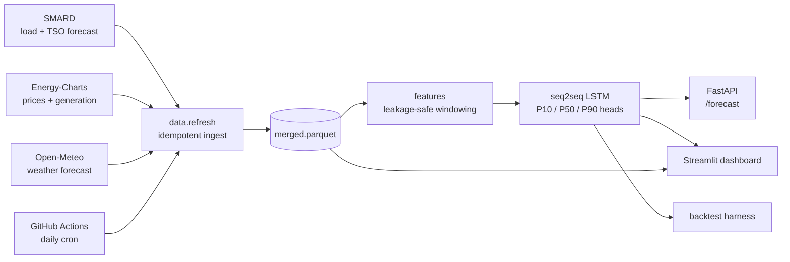

# Day-Ahead German Load Forecasting — Beating the TSO Baseline

> A neural network that predicts Germany's electricity demand for tomorrow,
> trained on public data and measured directly against the grid operator's
> own forecast. Across 14 months of testing the deployed model cuts the
> operator's average error by **~20 %**, and up to **+39 % on extreme days**.

### → Live demo: **[german-load-forecast-v1.streamlit.app](https://german-load-forecast-v1.streamlit.app/)**

Pick tomorrow, or any past day in the holdout, and see the model's forecast next to the operator's published one. Interactive uncertainty bands, hour-of-day error breakdown, and a few notable case-study days pre-loaded (record renewables-glut day, holiday weekends, summer heatwaves).


**Tomorrow's forecast** — re-rendered every day from the live model:


## Why this project

Every European grid operator publishes a forecast of how much electricity the country will use the next day. In Germany this lives on the public [SMARD](https://www.smard.de/) portal as `fc_cons__grid_load`, and it's the **operational baseline** every utility, energy trader, and balancing-responsible party plans against.

This project trains a TensorFlow model on the same public data and measures itself directly against that published forecast. Most machine-learning portfolio projects compare a model to a naive baseline and stop there. Beating a real, public, *operational* forecast — and being able to point to the live numbers — is a qualitatively different signal.


### Where the improvement comes from

Five LSTM variants, each adding one feature group on top of the previous, all scored on the same 70-day test set:

| Variant | Improvement vs TSO | Δ vs previous |
|---|---|---|
| Calendar only (hour / day-of-week / holiday) | +4.7 % | — |
| + Recent load history | +9.7 % | +5.0 pp |
| **+ Recent forecast error** (`actual − TSO`) | **+23.7 %** | **+13.9 pp** ⭐ |
| + TSO forecast as a decoder feature | +22.9 % | −0.8 pp |
| + Weather (4 NWP variables) | +24.2 % | +1.4 pp |

The single biggest lever is **showing the model the operator's recent errors**. On its own that one feature delivers more than half the project's total improvement. Adding the operator's forecast a second time as a decoder feature is roughly neutral — a deliberate negative result, since the model is already trained to predict the operator's *error*, the forecast itself doesn't carry extra signal.

## Architecture



Every prediction respects an **issue-time cutoff of 12:00 Berlin time on the day before delivery** — the German day-ahead market gate. A "corrupt-future" test scrambles every post-cutoff value in the source data and asserts the resulting features are byte-for-byte identical, so leakage isn't a thing we hope for, it's tested.

## Approach

- **Residual learning.** Instead of predicting load directly, the model predicts the *operator's error* — `actual − TSO_forecast` — and applies the correction. The operator already nails the easy 90 % (calendar, climatology); the model only has to learn the systematic remainder.
- **Sequence-to-sequence LSTM.** A 64-unit encoder reads the past 7 days of history, hands its state to a 64-unit decoder, which generates 96 quarter-hour predictions for the delivery day. Three output heads produce the P10, P50, and P90 quantile bands. ~36 k parameters total — small enough to train in 3 minutes on a CPU.
- **Weather from Open-Meteo.** Temperature, solar radiation, wind speed at 100 m, cloud cover — all population-weighted across 6 German load centres. Adds modest average lift but matters disproportionately on extreme-weather days.
- **Self-refreshing data layer.** Energy-Charts, SMARD, and Open-Meteo all expose authentication-free APIs. One CLI command rebuilds the parquet from public sources; a GitHub Action does it nightly.

## Repo layout

```
src/loadforecast/
  data/        # multi-source ingestion (Energy-Charts, SMARD, Open-Meteo)
  features/    # leakage-safe feature builders (calendar, lags, availability)
  models/      # Keras models, dataset windowing, predict wrappers
  backtest/    # rolling-origin evaluator + TSO + SARIMAX baselines
  serve/       # FastAPI inference service
dashboards/    # Streamlit dashboard (deployed to Streamlit Cloud)
tests/         # pytest — leakage tests, baseline harness, API smoke
notebooks/     # 8 visualisation + explanation notebooks
scripts/       # training, refresh, exploration utilities
```

## Quickstart

```bash
conda create -n loadforecast python=3.11 -y
conda activate loadforecast
pip install uv && uv pip install -e ".[dev]"

# 1. Verify install
pytest -q

# 2. Refresh the data parquet from public APIs (~5 min)
python -m loadforecast.data.refresh --rebuild --start 2022-01-01

# 3. Train the LSTM (~3 min on CPU)
python scripts/train_lstm_quantile.py

# 4. Run the dashboard locally
streamlit run dashboards/app.py

# 5. Or hit the inference service
uvicorn loadforecast.serve.api:app
# then POST to localhost:8000/forecast {"delivery_date": "2026-05-06"}
```

## Data sources

| Source | What | Auth |
|---|---|---|
| [SMARD](https://www.smard.de/) (Bundesnetzagentur) | Total grid load, TSO load forecast | none |
| [Energy-Charts](https://api.energy-charts.info/) (Fraunhofer ISE) | Day-ahead prices for 15 bidding zones, actual generation by source | none |
| [Open-Meteo](https://open-meteo.com/) | Numerical weather prediction (forecast endpoint) | none |

All data is licensed CC-BY 4.0.

## What's next

- **Daily GitHub Action** — refreshes the parquet and re-renders tomorrow's PNG every day at 13:00 CET, so the dashboard is always current without human intervention.

## License

MIT. Data: CC-BY 4.0 (SMARD / Bundesnetzagentur, ENTSO-E).
